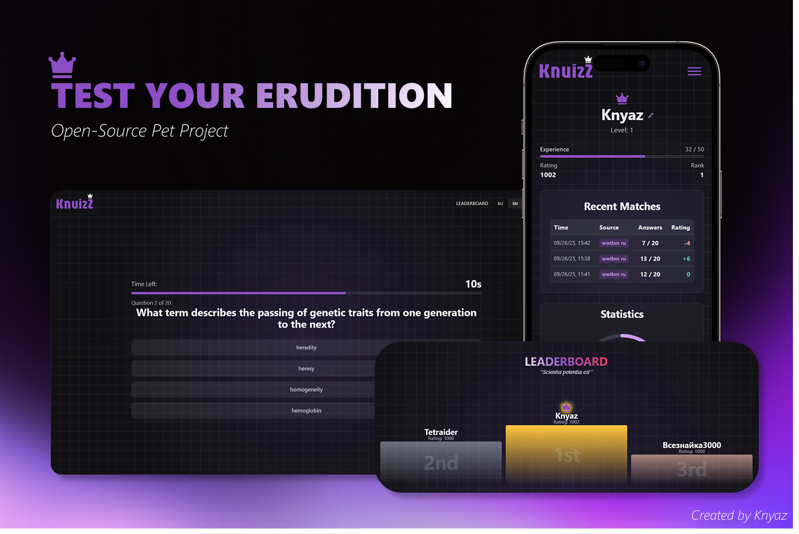
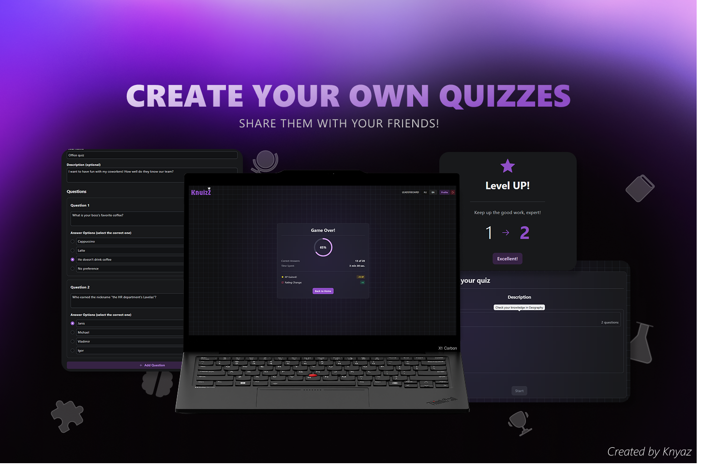

# Knuizz — A Quiz Training Project

*For the Russian version, please see [README.ru.md](./README.ru.md).*
***

**Knuizz** is a full-stack training project created to practice and demonstrate web development skills. It's a simple application for creating and taking quizzes, featuring a backend on ASP.NET Core and a frontend on React.

## Features

*   **Play Quizzes**: Answer questions from multiple sources, including "official" ones (with rating points) and those created by other users.
*   **Create Your Own Quizzes**: After registering, you can create your own question sets and share them.
*   **Compete**: A simple rating and level system, along with a leaderboard to track progress.
*   **Manage Your Profile**: Users can view their statistics and manage their created quizzes.

## Demo

A live demo is available at [this link](https://www.knuizz.knyaz.eu/).

## Gallery




## Tech Stack

### Backend (ASP.NET Core API)
*   **Framework**: .NET 9, ASP.NET Core
*   **Database**: PostgreSQL & Entity Framework Core
*   **Authentication**: JWT
*   **Testing**: NUnit for unit tests
*   **API Documentation**: Swagger + Redoc

### Frontend (React)
*   **Build Tool**: Vite
*   **Framework**: React
*   **State Management**: Redux Toolkit (with RTK Query)
*   **Styling**: Tailwind CSS & Radix UI
*   **Routing**: React Router
*   **Internationalization**: i18next


## Quickstart (Docker Compose)

This method will launch the entire application (API, client, and database) in Docker containers.

### 1. Prerequisites

*   [Docker](https://www.docker.com/) must be installed and running.

### 2. Clone the Repository

```bash
git clone https://github.com/KnyazLV/Knuizz.git
cd knuizz
```


### 3. Configure Environment Variables

Open the `docker-compose.yml` file and replace the placeholder values in the `environment` section of the `api` service:

*   `POSTGRES_PASSWORD`: A password for the database.
*   `ConnectionStrings__DefaultConnection`: Ensure the password here matches `POSTGRES_PASSWORD`.
*   `Jwt__Key`: Generate and insert a long, random key (at least 32 characters).
*   `Jwt__Issuer`: Your API's identifier (e.g., `KnuizzApi`).
*   `Jwt__Audience`: Your client's identifier (e.g., `KnuizzApiClient`).

### 4. Launch the Application

From the root project folder, run:

```bash
docker-compose up --build
```
The first launch may take some time.

### 5. Access the Application

*   **Web Client:** `http://<your-host-address>:5173` (e.g., `http://localhost:5173`)
*   **API Documentation:** `http://<your-host-address>:5130/swagger` (e.g., `http://localhost:5130/swagger`)


## Local Setup (Without Docker)

This method requires manual installation of .NET, Node.js, and PostgreSQL.

### 1. Run the API (Backend)

*   **Set up `user-secrets`** for the `Knuizz.Api` project. Navigate to `src/Knuizz.Api` and run the following commands with your values:
    ```
    dotnet user-secrets set "ConnectionStrings:DefaultConnection" "Host=localhost;Database=knuizz_db;Username=postgres;Password=YOUR_PASSWORD"
    dotnet user-secrets set "Jwt:Key" "YOUR_SUPER_SECRET_JWT_KEY_32_CHARS_LONG"
    dotnet user-secrets set "Jwt:Issuer" "KnuizzApi"
    dotnet user-secrets set "Jwt:Audience" "KnuizzApiClient"
    ```
*   **Apply database migrations:**
    ```
    dotnet ef database update
    ```
*   **Run the API:**
    ```
    dotnet run
    ```

### 2. Run the Client (Frontend)

*   **Navigate to the client directory:**
    ```
    cd ../knuizz-web 
    ```
*   **Create a `.env` file** and add your API's address:
    ```
    VITE_API_URL=http://localhost:5130
    ```
*   **Install dependencies and start:**
    ```
    npm install
    npm run dev
    ```
